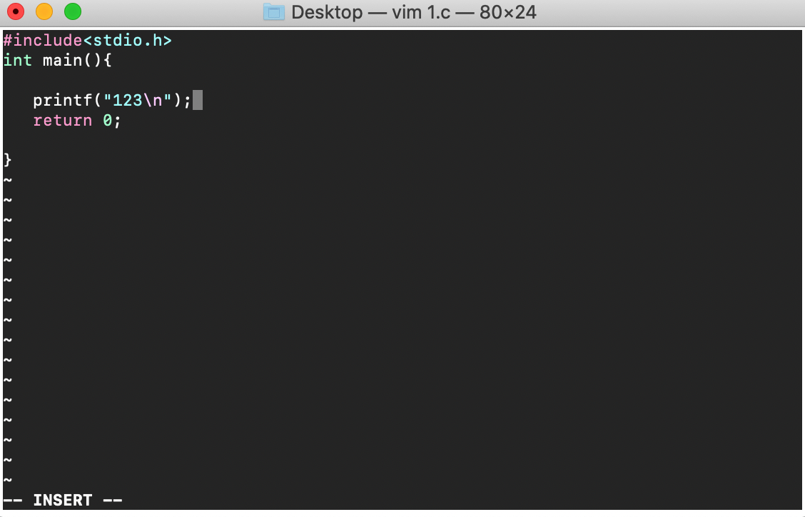

# Vim配置及其使用

#### 前言

开始搞数据结构与算法了，准备使用Vim来刷题，不害怕手写算法！

#### 配置

- 新建文件夹

  ```nginx
  mkdir ~/.vim
  mkdir ~/.vim/colors
  ```

- 下载主题包

  我是从[主题包](https://github.com/flazz/vim-colorschemes)下载的，然后把下载好的色彩主题包中`/colors/`文件夹需要的主题拷贝到`~/.vim/colors/`中就可以使用了。

- 配置vim环境，使主题包生效

  在终端中输入以下命令

  ```nginx
  vim .vimrc
  ```

  打开*.vimrc*文件，输入下面两行文字:

  ```nginx
  colorscheme 主题名称 # 没有后缀,如我的主题是1989.vim 输入1989即可
  syntax on  # 同步
  ```

- 验证

  进入到需要创建文件的文件夹，使用vim创建一个*hello.c*文件

  ```nginx
  vim hello.c
  ```

  即可看见刚才添加的主题生效了

  

- 设置vim字体大小

  快捷键:Command  + "+"即可缩放字体 

  

#### 使用

