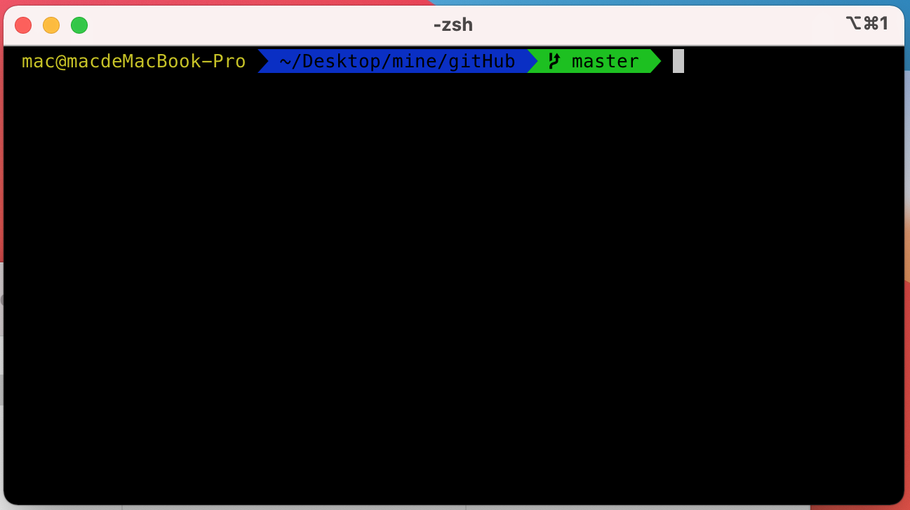
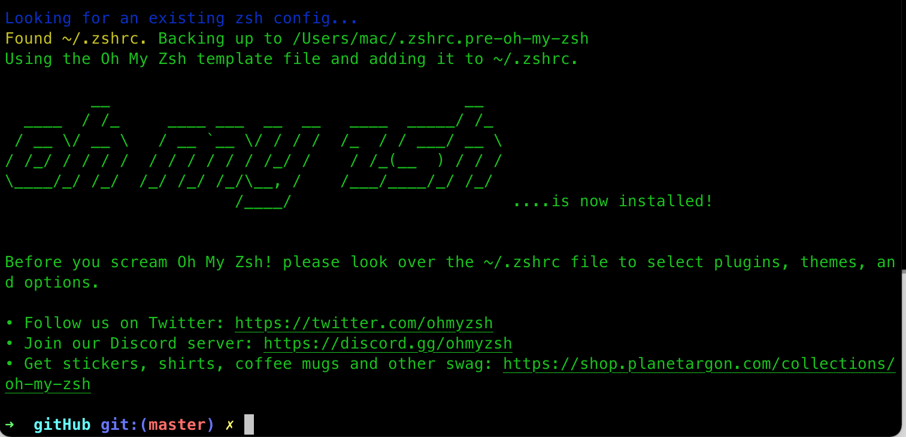
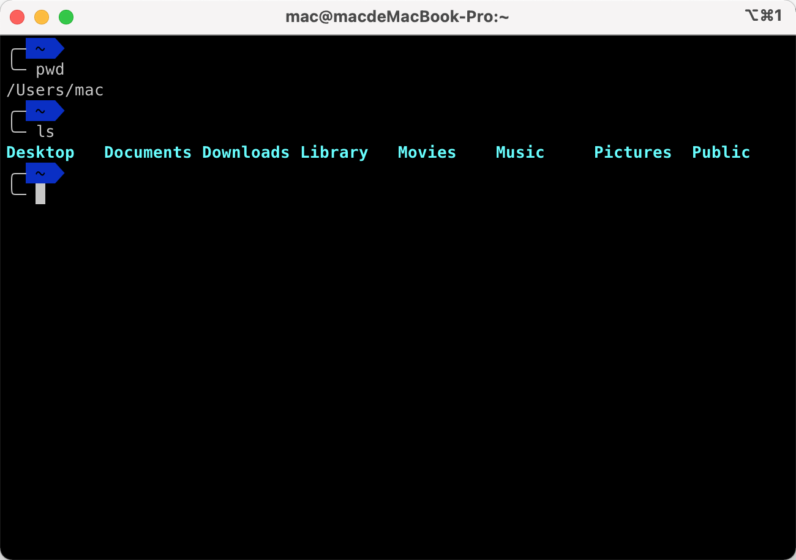
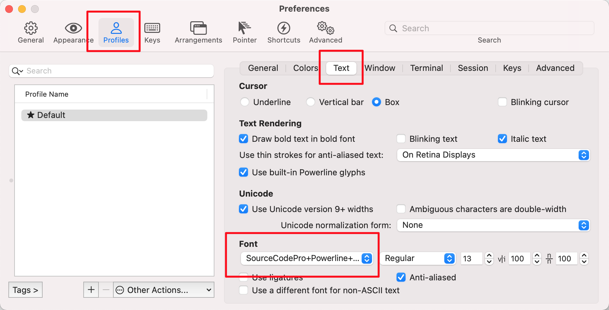
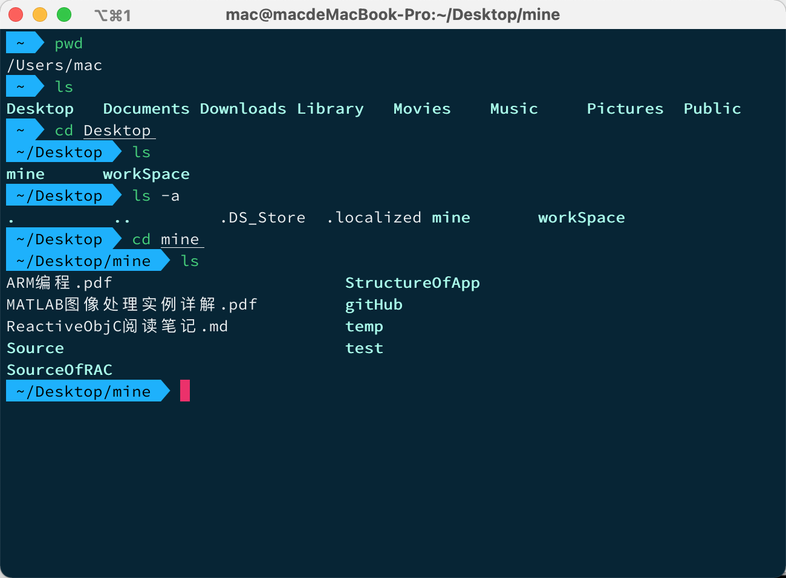

# iTerm2美化记录

#### 摘要(Abstract)

记录iTerm2美化过程，以后好参考。

#### 安装iTerm2

[Download iTerm2](https://iterm2.com/)，下载安装即可:



确实比较丑!

#### 配置iTerm2

- 安装**oh-my-zsh**

  ```nginx
  sh -c "$(curl -fsSL https://raw.github.com/robbyrussell/oh-my-zsh/master/tools/install.sh)"
  ```

  安装成功后的界面:

  

  

- 安装主题

  我选用的主题是[Powerlevel9k](https://github.com/Powerlevel9k/powerlevel9k)。

  ```nginx
  git clone https://github.com/bhilburn/powerlevel9k.git ~/.oh-my-zsh/custom/themes/powerlevel9k
  ```

  配置Powerlevel9k

  ```nginx
  # 打开 .zshrc文件
  vim .zshrc  # 当前目录和 .zshrc文件同级
  
  # 配置时 切记不要留空格
  # 默认主题
  # ZSH_THEME="robbyrussell"
  # 当前使用的主题
  ZSH_THEME="powerlevel9k/powerlevel9k"
  # 不显示hostname
  DEFAULT_USER=`id -un`
  # 右侧不显示时间和状态
  POWERLEVEL9K_RIGHT_PROMPT_ELEMENTS=()
  # 光标显示在下一行
  POWERLEVEL9K_PROMPT_ON_NEWLINE=true
  
  # 退出保存
  source ~/.zshrc
  ```

​        

​          

- 安装字体

  我安装的是*SourceCodePro+Powerline+Awesome+Regular(.tff文件需要双击安装)*。打开 iTerm2 的偏好设置 preference ，点开 profiles下 的Text选项，点击Font选择*SourceCodePro+Powerline+Awesome+Regular*即可。

  

  

- 添加配色方案

  配色方案我在Github上找的*flat-colors*。设置当前配色方案:

  打开 iTerm2 的偏好设置 preference ，点开 profiles 下的colors 选项，点击右下角的 Color Presets 选项，选择import ，导入*flat-colors.itermcolors*文件即可。

  注: 字体和配色文件会放在github上。

- 安装插件

  **oh-my-zsh**有很多插件。我这里安装的是语法高亮插件:

  ```nginx
  # 安装语法高亮插件
  git clone git://github.com/zsh-users/zsh-syntax-highlighting $ZSH_CUSTOM/plugins/zsh-syntax-highlighting
  ```

  下载完毕后要去*.zshrc*文件中配置插件

  ```nginx
  # 打开配置文件
  vim .zshrc
  
  # 配置插件 如果有多个插件 插件与插件之间使用空格隔开
  plugins=(git zsh-syntax-highlighting)
  
  # 同步
  source ~/.zshrc
  ```

- 最终效果

  执行完上述步骤后，打开iTerm2，就能看见一个比较好看的界面了。

  

​        

  


