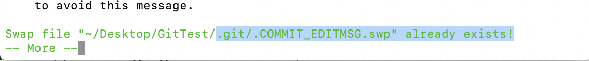

# Git学习笔记

```nginx
pwd:查看当前路径
mkdir 文件夹名称  :  创建文件夹

配置用户名和邮箱
git config --global user.email "邮箱"
git config --global user.name "名称"

查看用户名和邮箱
vim .gitconfig (注意前面有".")


初始化本地仓库(进入对应目录)
git init

ls -a :可以查看隐藏的文件(.开头的)

git status:查看提交区的状态 (是否有文件没提交到提交区)  提交区:暂存区
git add . :提交所有文件到提交区 (如果要提交指定的文件 如1.txt : git add 1.txt)
git commit -m "更新信息" : 把文件从提交区提交到本地git仓库

touch xx.txt  :创建空白的文件
```

如果现在有30个文件  只想把其中10个文件提交到git仓库 采用忽略文件的操作命令

```nginx
# 1.创建.gitignore文件
vim .gitignore
# 2.编辑.gitignore
如想不提交.txt结尾的文件
*.txt
保存即可

执行 git status 可以看到 *.txt文件被忽略了
```

从本地仓库中删除文件

```nginx
git rm 文件名.txt # 注意 这种方式会将文件完全删除 本地文件也会被删除

git rm --cached  文件名.txt # 这种方式只是删除了本地git仓库中的文件 本地的文件不会被删除
```

更改版本库中的文件名称

```nginx
git mv 原文件名称 更改的名称  # git mv 1.txt 8.txt
git commit -m "更改名称"  # 要提交
```

查看操作日志

```nginx
git log  # 会把每一次提交的信息输出来 并有hash作为版本号
git log -p # 文件变动信息
git log -p -1(数值1)  # 查看最近一次提交
git log --oneline #显示提交的简短信息
git log --oneline -p #显示提交的简短信息
git log --name-only # 查看文件变化信息
git log --name-status # 查看文件变化具体信息
```

结束git命令

```nginx
control + z
control + c 直接跳到下一行(当前行命令不执行)
```

本地git仓库版本回退

```nginx
git reflog # 获取回退版本的commit id  (列出所有的commitID)
git reset --hard commitID # 回退到指定版本
```

修改最新一次提交的信息

```nginx
git commit --amend # 打开vim编辑器 编辑完成之后 退出保存即可 ESC + WQ
git log # 就可以看见提交信息了
```

如果出现下图的问题



删除.COMMIT_EDITMSG.swp文件即可

```nginx
rm .git/.COMMIT_EDITMSG.swp
```


#### 管理暂存区的文件

如a.txt 已经被我们添加进入了暂存区，想要撤销回文件区

```nginx
#从暂存区撤销 a.txt  这种是 a.txt 第一次添加到暂存区(这个文件以前都没添加过)
git rm --cached a.txt

# 如果是 a.txt 不是第一次添加到暂存区 即 git add a.txt 很多次了 从暂存区撤回的命令
git reset HEAD a.txt

# 查看文件中的内容
cat a.txt
# 将 a.txt 恢复到上一次编辑时候的状态
git checkout -- a.txt #注意 有空格

```


#### 分支

- 本地

```nginx
#查看本地分支列表
git branch

#创建分支
git branch 分支名称

#切换分支
git checkout 分支名称

# 创建并切换到新创建的分支 (两个操作:创建分支和切换分支)
git checkout -b 分支名称

```


**origin** 远程仓库的名字

**master** 分支的名称

本地仓库合并分支

```nginx
# 切换到目标分支
git checkout 目标分支 (也就是合并后代码要合并到的分支,如想把A分支的代码合并到master，目标分支就是master)
# 合并分支
git merge 源分支 (如A分支)
```


本地库和远程库关联并提交代码

```nginx
git remote -v  # 查看本地和远程服务器关联状态
# 如下列状态
origin	https://github.com/HZHCoder1990/BeginerForShaderToy.git (fetch)
origin	https://github.com/HZHCoder1990/BeginerForShaderToy.git (push)

# 查看所有分支(远程分支和本地分支) 显示红色的是远程分支
git branch -a 

git remote add origin 你的远程库地址  # 把本地库与远程库关联
git push -u origin master    # 第一次推送时 推送到 master分支
git push origin master  # 第一次推送后，直接使用该命令即可推送修改

# 如果本地创建了分支 但是远程没有 执行下面命令把本地分支推到远程服务器
git push origin 本地分支名称:远程分支名称(最开始没有)
# 如 git push origin Huang:某某

# 总结一下
# 1.首选从远程仓库clone代码: git clone 远程仓库地址 本地存储路径
# 2.本地仓库创建分支: git checkout -b 分支名称
# 3.把分支推到远程仓库 : git push origin 分支名称:远程分支名称

```

