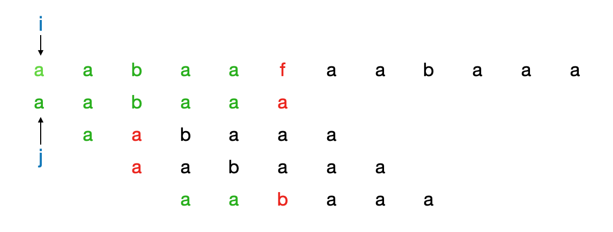
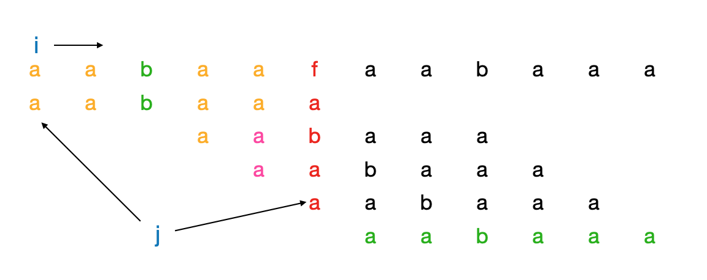

<font color=2E8B57>给定一个长度为$m$的**字符串A**，判断是否包含另一长度为$n$的**字符串B**($n \leq m$)。</font>

**A = "aabaafaabaaa"**

**B = "aabaaa"**

#### BF算法



当$A[i] \neq B[j]$时，$i++，j++$。再进行匹配。

#### KMP算法

相比较于BF算法，KMP算法的思路是：已经能确定匹配了的字符就没必要再进行匹配了。



图中字符串"aa"是能确定已经匹配到了的，下次再比较时可以跳过，直接从"aa"的下一个字符开始比较。这样就能节省很多比较步骤。所以KMP算法的核心就是**寻找最长子串**。

**前缀表(Prefix Table，Next数组 )**

- 字符串的真前缀

  除开末尾字符所构成的字符串集合。如B的真前缀集合为:{"a","aa","aab","aaba","aabaa"}

- 字符串的真后缀

  除开首字符所构成的字符串集合。如B的真后缀集合为:{"abaaa","baaa","aaa","aa","a"}

 前缀表是一个数组，保存的是字符串真前缀集合和真后缀集合交集元素中长度最长的值。如{"a","aa","aab","aaba","aabaa"}和{"abaaa","baaa","aaa","aa","a"}的交集为{"aa","a"}，其中长度最长的是"aa"，即前缀表对应位置保存的值为"aa"的长度2。

字符串B的前缀表如下所示：

| 字符  | a    | a    | b    | a    | a    | a    |
| ----- | ---- | ---- | ---- | ---- | ---- | ---- |
| Index | 0    | 1    | 2    | 3    | 4    | 5    |
| Value | 0    | 1    | 0    | 1    | 2    | 2    |

Next数组中保存的是对应位置最大共有字符串的长度。

```java
/**
	 * 生成KMP算法中的 前缀匹配表
	 * next数组中保存了对应位置最大子串的长度
	 * @param str
	 * @param next
	 */
	public static void generateNext(String str,int[] next) {
		
		next[0] = 0;
		int j = 0;
		for (int i = 1; i < str.length(); i++) {
			// 1.字符不相等  j > 0 是为了防止数组下标为负的情况
			while (j > 0 && str.charAt(i) != str.charAt(j)) {
				// 回溯到 [j - 1]值的位置 再开始比较
				j = next[j - 1];
        
        // 这里为什么是这样的呢?
       /** 
         str.charAt(i) != str.charAt(j) 
         表示在j位置没有和i位置存在共有字符串
         从j的上一个位置去寻找共有字符串 [j - 1] (共有字符串的长度更短)
         
         i表示后缀  j表示前缀
       */
			}
			// 2.字符相等 最长子串长度增加1
			if (str.charAt(i) == str.charAt(j)) {
				j ++;
			}
			// 3.更新next数组中的值
			next[i] = j;
		}
	}
```

> 假设B = "abaa"
>
> j 表示前缀字符串末尾位置
>
> i表示后缀字符串的末尾位置
>
> B[j] = B[i] 表示前缀和后缀字符串存在共有字符串，反之则不存在
>
>  j = next[j - 1] 表示获取长度更短的共有字符串。
>
> 程序是说:
>
> 如果B[i] = B[j] 共有字符串长度+1(j ++，i ++); 
>
> 如果不相等 i ++，j的值由j上一个位置的值决定。 j = next[j - 1]


```java
public static void match(String src,String des,int[] next) {
		
		int j = 0;
		boolean result = false;
		for (int i = 0; i < src.length(); i++) {
			while (j > 0 && src.charAt(i) != des.charAt(j)) {
				 j = next[j - 1];
			}
			if (src.charAt(i) == des.charAt(j)) {
				j ++;
			}
			
			if (j == des.length()) {
				result = true;
				System.out.println("找到了 j = " + (i - j + 1));
				break;
			}
		}
		if (!result) {
			System.out.println("没找到");
		}
}

public static void main(String[] args) {
		
		String src = "aabaafaabaaa";
		String des = "aabaaa";
		int[] next = new int[des.length()];
		generateNext(des, next);
		match(src, des, next);		
}
```


```java
while (j > 0 && str.charAt(i) != str.charAt(j)) {
				// 回溯到 [j - 1]值的位置 再开始比较
				j = next[j - 1];
	}
```

这句代码理解的不是很清楚!!!!!!!


- 参考链接

  [彻头彻尾的理解kmp](https://www.huaweicloud.com/articles/f5323928ed39c473cb2daf88bfc40c8f.html)

  [KMP算法最浅显理解——一看就明白](https://blog.csdn.net/starstar1992/article/details/54913261)

  [如何更好地理解和掌握 KMP 算法?](https://www.zhihu.com/question/21923021)

