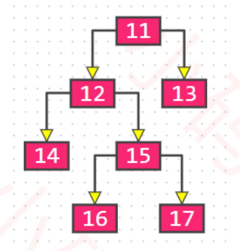
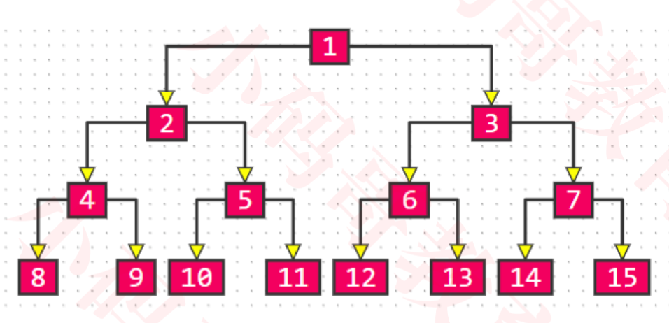

# 二叉树

### Concept(概念)

- 树的基本概念

  > 1. 节点、根节点、父节点、子节点、兄弟节点(同一个父节点)
  >
  > 2. 一棵树可以没有任何节点，称为**空树**
  >
  > 3.  一棵树可以只有1个节点，也就是**只有根节点**
  >
  > 4. 子树、左子树、右子树
  >
  > 5. **节点的度(degree):子树的个数**
  >
  > 6. **树的度:所有节点度中的最大值**
  >
  > 7. **叶子节点(leaf):度为0的点(没有任何子树);非叶子节点:度不为0的节点**
  >
  > 8. **层数(level):根节点在第一层，根节点的子节点在第二次，依次类推**
  >
  > 9. **节点的深度(depth):从根节点到当前节点的唯一路径上的节点总数**
  >
  > 10. **节点的高度(height):从当前节点到最远叶子节点路径上的节点总数**
  >
  > 11. **树的高度:所有节点高度中的最大值**
  >
  > 12. **树的深度:所有节点深度中的最大值**
  >
  > 13. **树的高度等于树的深度**

### Binary Tree(二叉树)

- 二叉树的特点

  1. 每个节点的**度**最大为2(最多拥有2课子树)

  2. 左子树和右子树是有顺序的

  3. 即使某节点只有一颗子树，也要区分左右子树

- 二叉树的性质

  1.  非空二叉树的第$i$层，最多有$2^{i-1}$个节点($i\geq 1$)

  2. 高度为$h$的二叉树上最多有$2^{h}-1$个节点($h\geq 1$)

  ​       推导:每一个节点都有左右子节点，每一层节点数进行累加:
  $$
  2^{0} + 2^{1} + 2^{2} + ... + 2^{h-1} = 2^{h} -1
  $$
  3. 对于任何一课非空二叉树，如果叶子节点个数为$n_0$，度为$2$的节点个数为$n_2$，则有:$n_0=n_2+1$

  ​       推导: 假设度为$1$的节点个数为$n_1$，那么二叉树的节点总数为$n = n_0 + n_1 + n_2$；二叉树的边数(度为1有一条边，度为2有两条边)$T=n_1 + 2 * n_2 = n - 1 = n_0 + n_1 + n_2 - 1$

#### 真二叉树(Proper Binary Tree)

​    **真二叉树**:所有节点的度要么为0，要么为2(不存在度为1的情况)。

   

#### 满二叉树(Full Binary Tree)

​     **满二叉树**:所有节点的度要么为0，要么为2，且所有的叶子节点都在最后一层。

 假设满二叉树的高度为$h (h\geq 1)$，那么:

1. 第$i$层的节点数量:$2^{i-1}$

2. 叶子节点数量:$2^{h-1}$

3. 总节点数量$n$:
   $$
   n = 2^{h} - 1 = 2^0 + 2^1 + 2^2 + ...+2^{h-1}
   $$

   $$
   h = log_2{(n+1)}
   $$

**在同样高度的二叉树中，满二叉树的叶子节点数量最多、总节点数量最多**

**满二叉树一定是真二叉树，真二叉树不一定是满二叉树**

#### 完全二叉树(Complete Binary Tree)

​     **完全二叉树**:叶子节点只会出现在最后两层，且最后1层的叶子节点都靠左对齐

**完全二叉树从根节点至倒数第二层是一颗满二叉树**

**满二叉树一定是完全二叉树，完全二叉树不一定是满二叉树**

完全二叉树的性质:

1. 度为1的节点只有左子树

2. 度为1的节点要么是1个要么是0个

3. 同样节点数量的二叉树，完全二叉树的**高度最小**

4. 假设完全二叉树的高度为$h (h\geq 1)$，那么:

   至少有$2^{h-1}$个节点($2^0+2^1+2^2...+2^{h-2}$)

   最多有$2^h - 1$个节点($2^0+2^1+2^2...+2^{h-1}$，满二叉树)

   总节点数量为$n$:
   $$
   2^{h-1} \leq n < 2^h
   $$

   $$
   h-1 \leq log_2{n} < h
   $$

   $$
   h = floor(log_2{n})+1
   $$

5. 

#### 单词

#### **proper**:完全地

