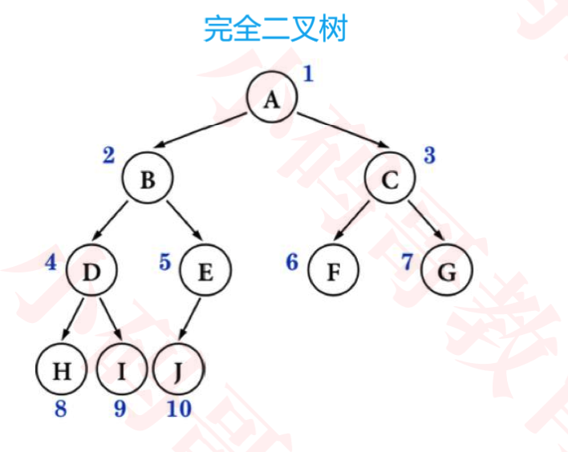

# 二叉树

#### Concept(概念)

- 树的基本概念

  1.节点、根节点、父节点、子节点、兄弟节点(同一个父节点)；

  2.一棵树可以没有任何节点，称为**空树**；

  3.一棵树可以只有1个节点，也就是只有根节点；

  4.子树、左子树、右子树；

  5.节点的度(degree):子树的个数；

  6.树的度:所有节点度中的最大值

  7.叶子节点(leaf):度为0的点(没有任何子树);非叶子节点:度不为0的节点

  8.层数(level):根节点在第一层，根节点的子节点在第二次，依次类推。

  9.节点的深度(depth):从根节点到当前节点的唯一路径上的节点总数；

  10.节点的高度(height):从当前节点到最远叶子节点路径上的节点总数；

  11.树的高度:所有节点深度中的最大值；

  12.树的深度:所有节点高度中的最大值；

  13.树的高度等于树的深度。

#### Binary Tree(二叉树)

- 二叉树的特点

  1.每个节点的度最大为2(最多拥有2课子树)

  2.左子树和右子树是有顺序的

  3.即使某节点只有一颗子树，也要区分左右子树

- 二叉树的性质

  1.非空二叉树的第$i$层，最多有$2^{i-1}$个节点($i$大于等于1)

  2.高度为$h$的二叉树上最多有$2^{h}-1$个节点($h$大于等于1)

  每一个节点都有左右子节点，每一层节点数进行累加:
  $$
  2^{0} + 2^{1} + 2^{2} + ... + 2^{h-1} = 2^{h} -1
  $$
  3.对于任何一课非空二叉树，如果叶子节点个数为$n_0$，度为$2$的节点个数为$n_2$，则有:$n_0=n_2+1$

  推导过程: 假设度为$1$的节点个数为$n_1$，那么二叉树的节点总数为$n = n_0 + n_1 + n_2$；二叉树的边数(度为1有一条边，度为2有两条边)$T=n_1 + 2 * n_2 = n - 1 = n_0 + n_1 + n_2 - 1$

#### 真二叉树(Proper Binary Tree)

真二叉树:所有节点的度要么为0，要么为2(不存在度为1的情况)。

#### 满二叉树(Full Binary Tree)

满二叉树:所有节点的度要么为0，要么为2，且所有的叶子节点都在最后一层。

#### 完全二叉树(Complete Binary Tree)

完全二叉树:叶子节点只会出现在最后两层，且最后1层的叶子节点都靠左对齐

