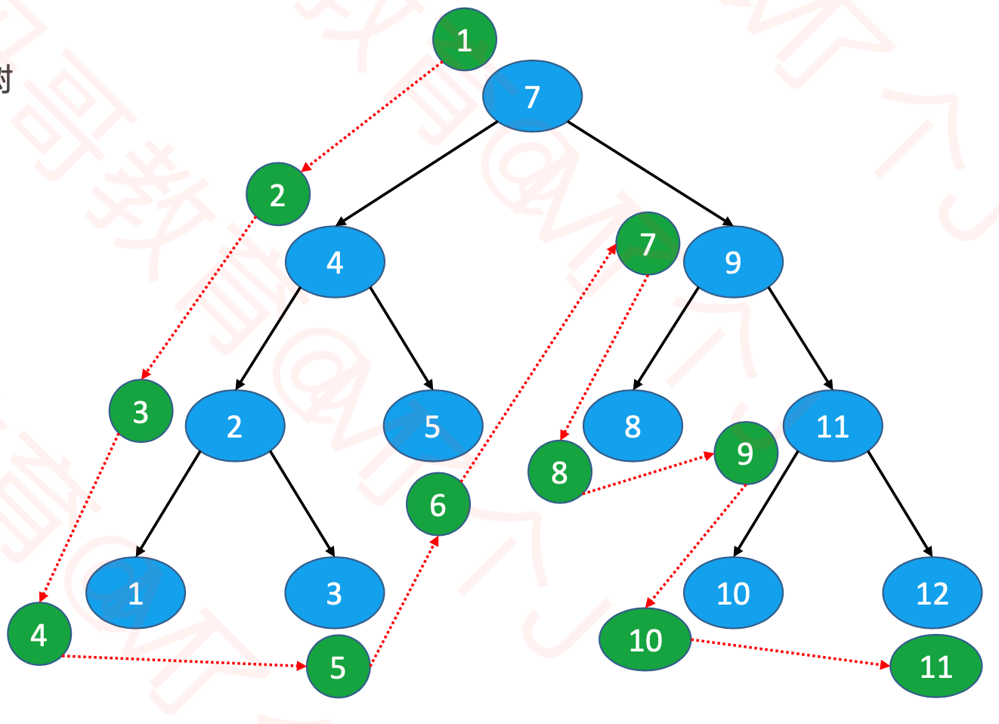
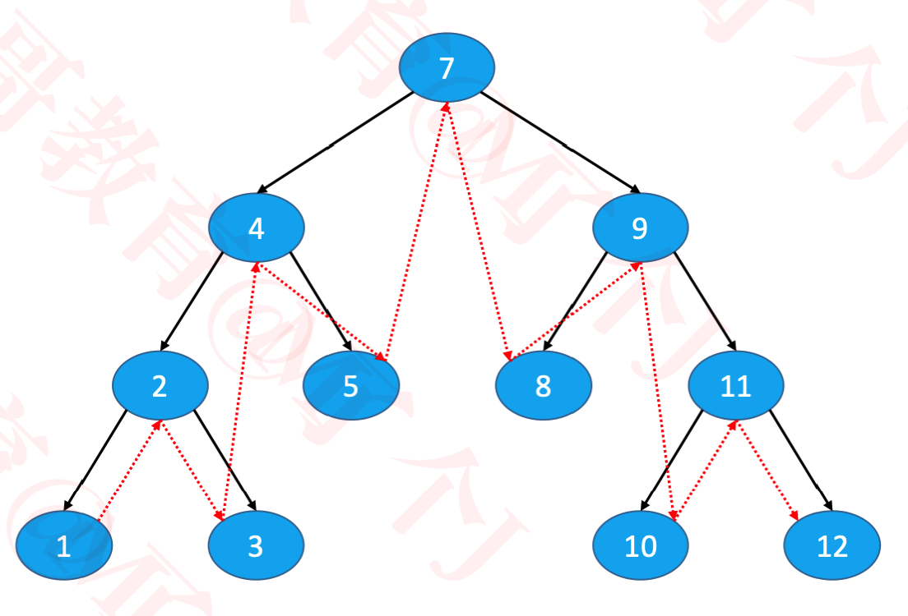
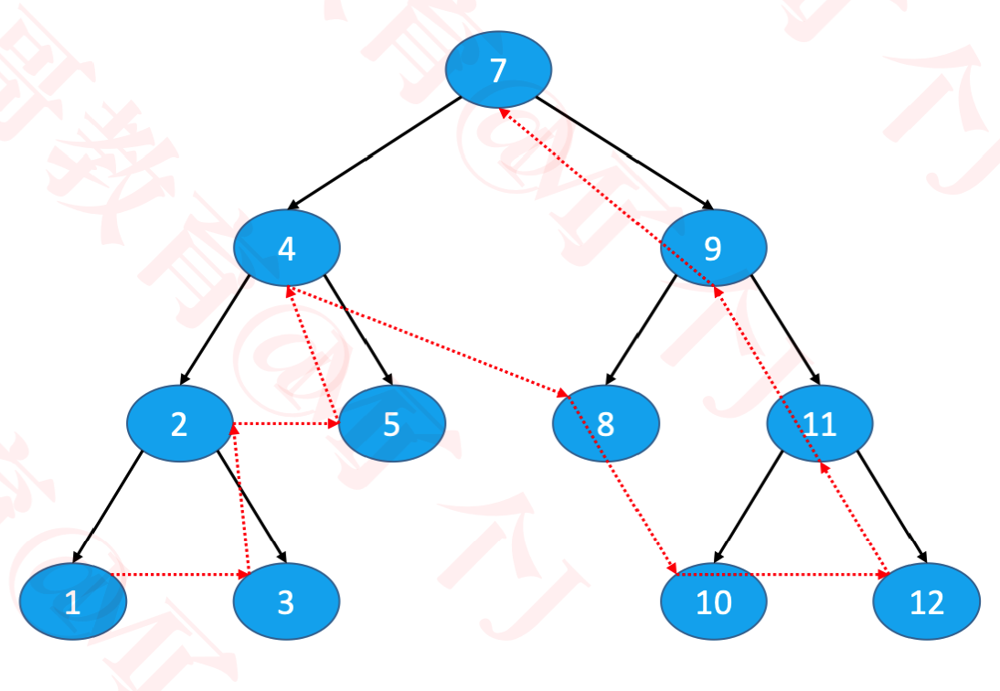
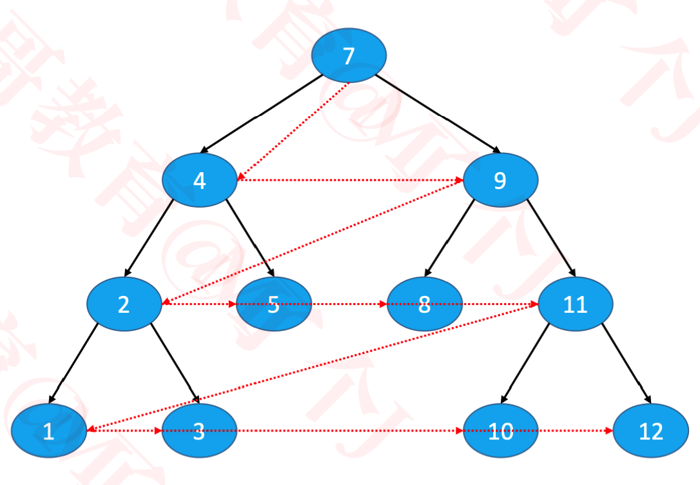

#### 二叉树的遍历

根据节点访问顺序的不同，二叉树的常见遍历有<font color=#F00>4</font>方式:

- 前序遍历(Preorder Traversal)
- 中序遍历(Inorder Traversal)
- 后序遍历(Postorder Traversal)
- 层序遍历(Level Order Traversal)


#### 前序遍历

<font color=FFA07A size=4>根节点、前遍历左子树、前序遍历右子树</font>



```java
/**
	 * 前序遍历
	 */
public void preorderTraversal() {
		preorderTraversal(root);
	}
private void preorderTraversal(Node node) {
		if (node == null) return; // 终止条件
		System.out.println(node.element);
		preorderTraversal(node.left); // 先打印左子树 
		preorderTraversal(node.right); // 再打印右子树
}
```


#### 中序遍历

<font color=32CD32 size=4> 中序遍历左子树、根节点、中序遍历右子树</font>



```java
/***
* 中序遍历
*/
public void inorderTravesal() {
		inorderTravesal(root);
}
private void inorderTravesal(Node node) {
		if (node == null) return;
		inorderTravesal(node.left);
		System.out.println(node.element);
		inorderTravesal(node.right);
}
```

**二叉搜索树的中序遍历结果是升序或降序的**


#### 后序遍历

<font color=5F9EA0 size=4> 后序遍历左子树、后序遍历右子树、根节点</font>



```java
public void postorderTraversal() {
		postorderTraversal(root);
}
private void postorderTraversal(Node node) {
		if (node == null) return;
		postorderTraversal(node.left);
		postorderTraversal(node.right);
		System.out.println(node.element);
}
```


#### 层序遍历

<font color=FF4500 size=4>从上往下、从左到右依次访问每一个节点</font>



