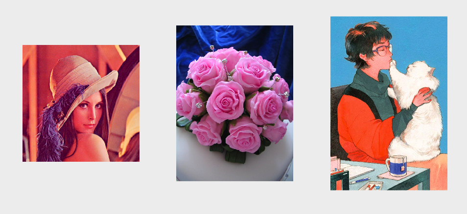
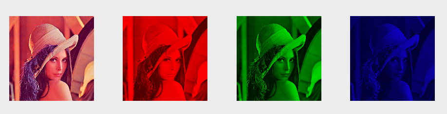

# Matlab学习笔记

## 基础图像处理(Basic Image Processing)

- Lesson 1:Extracting Image Properties using MATLAB

  Extracing:抓取、取出

  ```matlab
  close all;
  clc;
  
  % 获取图像的基本信息
  info = imfinfo('../images/lena.png');
  % filename 带有文件路径
  image_name = info.Filename;
  % 修改日期
  modification_date = info.FileModDate;
  % 大小(占用的字节数)
  image_size = info.FileSize;
  % 宽度
  image_width = info.Width;
  % 高度
  image_height = info.Height;
  % 色彩深度 8/16/24/32
  color_depth = info.BitDepth;
  % 色彩格式 truecolor:真彩图
  color_type = info.ColorType;
  % 格式 png/jpg....
  image_type = info.Format
  
  % ......
  % 更多的文件信息 直接info不加";"即可在控制台看见
  ```

- Lesson 2:Reading,Changing Format and Writing Image using MATLAB

  ```matlab
  close all;
  clc;
  
  % 读取图像
  I = imread('../images/lena.png');
  % 修改图像格式 png => jpg
  imwrite(I,'../images/newLena.jpg');
  ```

- Lesson 3:Displaying Images using MATLAB

  ```matlab
  close all;
  clc;
  
  % 读取图像
  I1 = imread('../images/lena.png');
  I2 = imread('../images/flower.png');
  I3 = imread('../images/avatar.jpg');
  
  % 显示 1行3列 ==> subplot(行、列、编号)
  subplot(1,3,1);imshow(I1);
  subplot(1,3,2);imshow(I2);
  subplot(1,3,3);imshow(I3);
  ```

  

- Lesson 4:Changing Color Space

  ```matlab
  close all;
  clc;
  
  % 读取图像
  original_image = imread('../images/lena.png');
  gray_image = rgb2gray(original_image);
  
  subplot(1,2,1);imshow(original_image);
  subplot(1,2,2);imshow(gray_image);
  ```

  


- Lesson 5:Separating/Splitting Channels using MATLAB

  ```matlab
  close all;
  clc;
  
  % 读取图像
  image_variable = imread('../images/lena.png');
  
  % 分别获取三个通道的像素值
  red_channel = image_variable(:,:,1);
  green_channel = image_variable(:,:,2);
  blue_channel = image_variable(:,:,3);
  
  subplot(1,3,1);imshow(red_channel);
  subplot(1,3,2);imshow(green_channel);
  subplot(1,3,3);imshow(blue_channel);
  ```

  


- Lesson 6:Accessing the Pixel Value of a Grayscale Image using MATLAB

  ```matlab
  close all;
  clc;
  
  % 读取图像
  image_variable = imread('../images/lena.png');
  gray_image = rgb2gray(image_variable);
  % 读取(50,60)位置处的像素 width * height 
  pixel_value = gray_image(50,60);
  sprintf("value = %d",pixel_value);
  ```

- Lesson 7:Accessing the Pixel Values of an RGB Image using MATLAB

  ```matlab
  close all;
  clc;
  
  % 读取图像
  image_variable = imread('../images/lena.png');
  % 第一个通道 红色
  red_value = image_variable(50,60,1);
  % 第二个通道 绿色
  green_value = image_variable(50,60,2);
  % 第三个通道 蓝色
  blue_value = image_variable(50,60,3);
  sprintf("red_value = %d green_value = %d  blue_value = %d",red_value,green_value,blue_value)
  ```

  


### 自己的练习

- 分别提取三通道的图像

  ```matlab
  close all;
  clc;
  
  % 分别提取三个通道的图像
  % 读取图像
  I = imread('../images/lena.png');
  
  % 提取R通道的图像
  R = I;
  R(:,:,1) = I(:,:,1);
  R(:,:,2) = 0;
  R(:,:,3) = 0;
  
  % 提取G通道的图像
  G = I;
  G(:,:,1) = 0;
  G(:,:,2) = I(:,:,2);
  G(:,:,3) = 0;
  
  % 提取B通道的图像
  B = I;
  B(:,:,1) = 0;
  B(:,:,2) = 0;
  B(:,:,3) = I(:,:,3);
  
  subplot(1,4,1);imshow(I);
  subplot(1,4,2);imshow(R);
  subplot(1,4,3);imshow(G);
  subplot(1,4,4);imshow(B);
  ```

  

### 语法(Syntax)


### 绘图(Graphics)


