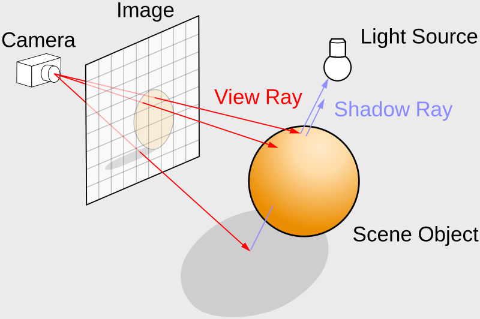
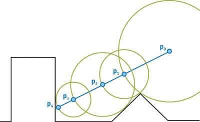
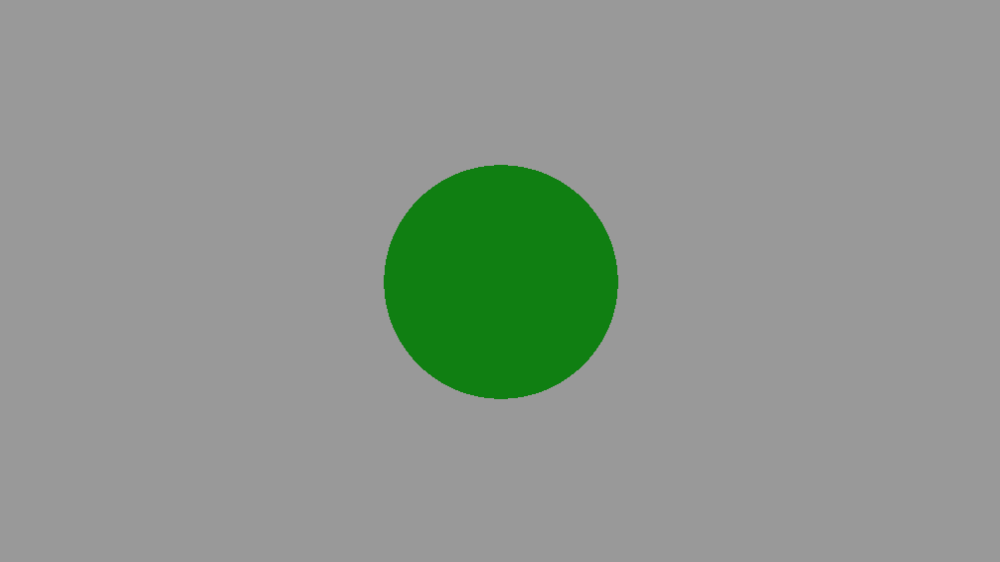
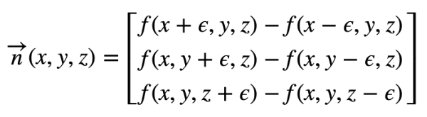
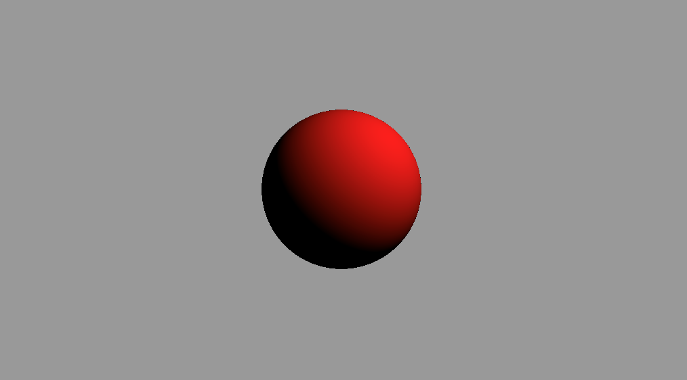

# RayMarching

##### Abstract

记录一下ShaderToy中3D场景的构建。

##### Ray Marching(射线行进)

**normalize**:归一化，通常用来表示方向(direction)

```glsl
# 比如一个向量
vec2 A = vec2(2,2);
# 执行归一化后
normalize(A) 
# 向量的方向不会发生改变，还是45°角;只是大小发生了改变，长度等于1 => length = 1
# x方向的夹角:
angleX = 2/sqrt(8)
angleY = 2/sqrt(8)
```

放一张很经典的图来描述3D场景:



#### Ray Marching

这里有一篇讲的很好的[文章](http://jamie-wong.com/2016/07/15/ray-marching-signed-distance-functions/)。引用GPU Gems2:Chapter 8中对Ray marching的描述的图片:



图中:${p_0}$可以看做是观察点(eye,look_at)，我们怎么知道$p_4$点处需要绘制呢($p_0 到 p_4射线方向是固定的$)？首先以$p_0$处为中心画圆，半径尽可能的大，直到触碰到场景中其他的点；然后以$p_1$点为中心重复以上的操作，直到最后画圆的半径尽可能小，即找到了需要绘制的点。用代码表示:

```glsl
#define EPSILON 0.001   // 阈值
#define MAX_MARCHING_STEPS 100  // 搜寻的最大步骤

float sceneSDF(vec3 p){
   return length(p) - 1.;
}
float getDist(vec3 eye,vec3 viewRayDirection,float start,float end){
    float depth = start;
    for (int i = 0;i < MAX_MARCHING_STEPS;i ++){
        float dist = sceneSDF(eye + depth * viewRayDirection);
        if (dist < EPSILON){
            // We're inside the scene surface!
            return depth;
        }
        // Move along the view ray
        depth += dist;
        if (depth >= end){
            // Gone too far; give up
            return end;
        }
    }
    return end;
}

void mainImage( out vec4 fragColor, in vec2 fragCoord )
{
    // <-1 1>
    vec2 uv = (fragCoord - .5 * iResolution.xy)/iResolution.y;
    vec3 ro = vec3(0.,0.,5.); 
    vec3 rd = normalize(vec3(uv,-1.));  
    float d = getDist(ro,rd,0.,100.); 
    vec3 col = vec3(0.);
    if (d >= 100.){ // 没撞到   注意大于等于号! >= end
       col = vec3(0.6);
    }else {
       col = vec3(0.,.5,.0);
    }
    fragColor = vec4(col,1.0);
}
```

我比较习惯下面的写法

```glsl
#define MAX_DIST 100.
#define EPSILON 0.001
#define MAX_MARCHING_STEPS 100   
// SDF:Signed Distance Function 符号距离函数
// 绘制球体 
float sdSphere(vec3 p,float r){
   return length(p) - r;
}

// ro:eye点
// rd:方向向量 即要对向量进行归一化处理 表示方向
float getDist(vec3 ro,vec3 rd){
   float depth = 0.;
  // 遍历 如果触碰到了遍历会走完 
   for (int i = 0;i < MAX_MARCHING_STEPS; i ++){
        // ro和rd的方向是相反的
        vec3 p = ro + depth * rd;
       // 1 代表绘制圆球的半径
        float d = sdSphere(p,1.);
        depth += d;
        if (depth < EPSILON || depth > MAX_DIST)  break;
   }
   return depth;
}

void mainImage( out vec4 fragColor, in vec2 fragCoord )
{
    vec2 uv = (fragCoord - .5 * iResolution.xy)/iResolution.y;
    vec3 ro = vec3(0.,0.,4.);// 值越小 看到的越大 
    vec3 rd = normalize(vec3(uv,-1.)); // 负的越多 看到的越大 
    float d = getDist(ro,rd); 
    vec3 col = vec3(0.);
    if (d > MAX_DIST){ // 没撞到
       col = vec3(0.6);
    }
    else{ // 撞到了 绘制球体的表面
       col = vec3(0.,.5,.0);
    }
    fragColor = vec4(col,1.0);
}
```



#### Add Lighting

- 计算射线与球体相交点的法线向量(单位向量)

  在2D空间中，计算某一个点$f(x,y)$的斜率可以通过下面的公式:
  $$
  \vec k = \frac{f(x_1 + \Delta) - f(x_1)}{\Delta}
  $$
  在3D空间中，假设球体表面一个点的坐标为$f(x,y,z)$，那么可以计算法向量的公式为:

  

  ```glsl
  // SDF
  float sceneSDF(vec3 p){
     return length(p) - 1.;
  }
  // p为球体表面点
  vec3 calcNormal(vec3 p){
     // ε
     float e = 0.005;
     return normalize(
             vec3(
                 sceneSDF(vec3(p.x + e,p.y,p.z)) - sceneSDF(vec3(p.x - e,p.y,p.z)),
                 sceneSDF(vec3(p,p.y + e,p.z)) - sceneSDF(vec3(p.x,p.y - e,p.z)),
                 sceneSDF(vec3(p.x,p.y,p.z + e)) - sceneSDF(vec3(p.x,p.y,p.z - e))
                 ));
  }
  ```

- Lambert Lighting

  兰伯特漫反射光照模型计算如下:
  $$
  c_{diffuse} = (c_{light}·m_{diffuse})max(0,{\vec n·\vec l})
  $$
  其中，$\vec n$是表面法向量(法线)，$\vec l$是指向光源的单位向量，$m_{diffuse}$是材质的漫反射颜色，$c_{light}$是光源颜色。需要注意的是，我们需要防止法线和光源方向点乘的结果为负值，为此，我们使用$max$函数将其截取到0，这可以防止物体被从后面来的光源照亮。

  ```glsl
  // 求取 "指向光源的单位向量"
  vec3 lightPosition = vec3(2,2,4);
  // p为球体表面上任意一点 
  vec3 lightDirection = normalize(lightPosition - p);
  
  // 求取球体表面 法向量
  vec3 normal = calcNormal(p);
  
  // 求取漫反射强度
  float diffuse = clamp(dot(normal,lightDirection),0.,1.);
  
  // 还可以指定材质的漫反射颜色
  vec3 diffuseColor = vec3(.5,.0,.0);
  
  // 最终呈现的颜色
  vec3 col = diffuseColor * diffuse;
  ```

完成代码

```glsl
#define EPSILON 0.001
#define MAX_MARCHING_STEPS 100
#define MAX_MARCHING_DIST  100.

float sdSphere(vec3 p,float r){
   return length(p) - r;
}

float getDist(vec3 ro,vec3 rd){
  float depth = 0.;
  for (int i = 0;i < MAX_MARCHING_STEPS; i ++){
      vec3 p = ro + depth * rd;
      float d = sdSphere(p,1.);
      depth += d;
      if (depth < EPSILON || depth > MAX_MARCHING_DIST) break;
  }
  return depth;
}
vec3 calcNormal(vec3 p){
  float e = 0.005;
  return normalize(vec3(
    sdSphere(vec3(p.x + e,p.y,p.z),1.) - sdSphere(vec3(p.x - e,p.y,p.z),1.),
    sdSphere(vec3(p.x,p.y + e,p.z),1.) - sdSphere(vec3(p.x,p.y - e,p.z),1.),
    sdSphere(vec3(p.x,p.y,p.z + e),1.) - sdSphere(vec3(p.x,p.y,p.z - e),1.)
  ));
}

void mainImage( out vec4 fragColor, in vec2 fragCoord )
{
    vec2 uv = (fragCoord - .5 * iResolution.xy)/iResolution.y;
    vec3 ro = vec3(0.,0.,5.);
    vec3 rd = normalize(vec3(uv,-1.));
    float d = getDist(ro,rd);// 观察点到球体表面的距离
    
    vec3 col = vec3(0.);
    if (d > MAX_MARCHING_DIST){
        col = vec3(.6);
    }else{
        vec3 p = ro + d * rd; // 球体表面
        float t = iTime;
        vec3 lightPosition = vec3(3. + cos(t),3. + sin(t),4.);
        vec3 lightDirection = normalize(vec3(lightPosition - p));
        vec3 normal = calcNormal(p);
        float diffuse = clamp(dot(normal,lightDirection),0.,1.);
        
        col = vec3(1.,.0,.0) * diffuse;
    }
    fragColor = vec4(col,1.0);
}
```




#### 总结

本章中，光照效果只是简单的添加了漫反射光照。如果想获得更真实的光照效果，还要学习更多的光照模型，如冯氏光照等；要深刻理解Ray Marching的核心算法，即不断遍历获取观察点到物体表面的距离；还有就是物体表面法向量的计算。

#### 参考链接

[Shadertoy Tutorials 6th](https://inspirnathan.com/posts/52-shadertoy-tutorial-part-6/)

#### 单词本

lope:斜率

ample:样本

leave you in awe:让你敬畏

awe:敬畏,可用作动词(使敬畏、赞叹)

PhD:博士学位(Doctor of Philosophy)

realm:领域、范围；王国

Behold:vt(看、注视；把....视为) vi(看) int(瞧；看呀)

a lot:许多

consists of:由...构成

assign:分配、赋值、将财产过户

actual:真实的，实际的；现行的，目前的

specification:规格；说明书；详述     复数(specifications)

magnitude:大小

diagonally:对角地；斜对地

dividing：区分

approximately:大约、近似

convention:约定、大会

combination:n 组合

Likewise:同样地

scalar:标量的；数量的；梯状的，分等级的   [数] 标量；[数] 数量

euclidean:欧几里得

shrunk:收缩

stretched:拉伸

portrayal:n 描绘、肖像

perpendicular:垂直的

orthogonal：正交的、直角的  n:正交直线

arithmetic:算术、数字

mentioned:提及，说起，谈到（mention 的过去式和过去分词）

correspond: 符合，一致；相应；通信

leverage：(n)手段，影响力；杠杆作用；杠杆效率  (v)利用；举债经营

cast:投射

photon:光子

ton：大量

